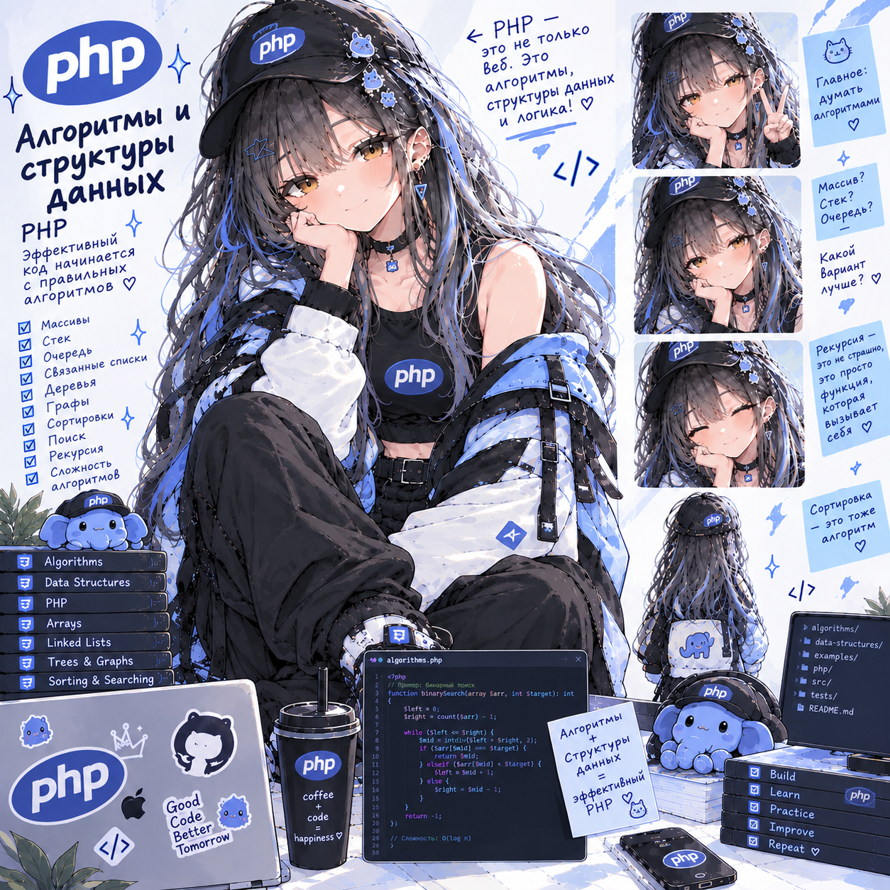

# Algorithms PHP Lab — CoffeeAlgo

**Статус: ⚪ методичка готова, прохождение впереди.**
**Сложность: базовая.** Проект самостоятельный, кода из других лаб не берёт. Нужен только синтаксис PHP; первые сессии используют лишь циклы, массивы и функции, сложное нарастает постепенно.

## О чём

Алгоритмы и структуры данных на PHP — от «сколько шагов делает цикл» до задач с собеседований. Каждая тема — на задаче кофейни, с тестом PHPUnit и замером времени. В большинстве тем есть шаг «сломать → починить»: невидимый O(n²), вырожденное дерево, обход без пометки посещённых.

## Стек

PHP 8.4 CLI, SPL, PHPUnit, Composer (только автозагрузка), Docker.

## Формат

Методичка [`Algo_Lab_CoffeeAlgo.html`](Algo_Lab_CoffeeAlgo.html) — открывается в браузере, прогресс по чекбоксам сохраняется локально. Вычитана 04.10.2026 (22 находки, все исправлены, числа в «Ожидаемом результате» пересняты запуском): находки — в репозитории [`lab-fixes`](https://github.com/meeymirita/lab-fixes), файл `backend/algorithms-php.md`.

## Что внутри (13 сессий, ~44 ч)

1. Мышление и сложность без формул; `Bench`, таблица роста, память
2. Массивы и строки
3. Хеш-таблицы и множества
4. Стек и очередь (`SplStack`, `SplQueue`)
5. Связные списки
6. Рекурсия
7. Бинарный поиск и сортировки, устойчивость
8. Два указателя, скользящее окно, префиксные суммы
9. Деревья (BST, обходы в глубину и ширину)
10. Кучи и приоритетные очереди, топ-K
11. Графы: BFS, DFS, Дейкстра
12. Динамическое программирование
13. Разбор собеседований: шаблон ответа, пять задач с замером, шпаргалка по сложностям
